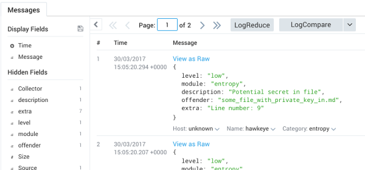

[](http://badge.fury.io/js/hawkeye-scanner)
[](https://www.npmjs.com/package/hawkeye-scanner)
[](https://travis-ci.org/Stono/hawkeye)
[](https://david-dm.org/Stono/hawkeye)
[](https://hub.docker.com/r/stono/hawkeye)


Hawkeye is a project security, vulnerability and general risk highlighting tool.  It has a few goals:

  - Designed to be entirely extensible by just adding new modules with the correct signature to [lib/modules](lib/modules)
  - Modules return results via a common interface, which permits consolidated reporting and artefact generation
  - Should be easy to run, be it via NPM, or Docker, on your Host, or in a CI Server

# Hosted/SaaS version now available!
By all means continue to use this CLI to get scans in your pipeline, but now you can use [this hosted version](https://hawkeye.website/) to get scanning _even faster!_.  Some of the benefits of the hosted version are:

  - Free (obviously)
  - Links to GitHub and scans both Public and Private repositories
  - GitHub "Push" scanning
  - On-demand one-click scanning
  - Scheduled scanning (great for continually checking for new issues in your deployed applications)
  - Email notifications when we find new issues
  - Consolidated dashboards

## Modules
Modules are basically little bits of code that either implement their own logic, or wrap a third party tool and standardise the output.  They only run if the required criteria are met, for example; the `nsp` module would only run if a `package.json` is detected in the scan target - as a result, you don't need to tell Hawkeye what type of project you are scanning.  The modules implemented so far are:

### Generic Modules:
 - __File Names (files)__: Scan the file list recursively, looking for patterns as defined in [data.js](lib/modules/files/data.js), taken from [gitrob](https://github.com/michenriksen/gitrob).  We're looking for things like `id_rsa`, things that end in `pem`, etc.
 - __File Content Patterns (contents)__: Looks for patterns as defined in [data.js](lib/modules/content/data.js) within the contents of files, things like 'password: ', and 'BEGIN RSA PRIVATE KEY' will pop up here.
 - __File Content Entropy (entropy)__:  Scan files for strings with high (Shannon) entropy, which could indicate passwords or secrets stored in the files, for example: 'kwaKM@£rFKAM3(a2klma2d'

### Node JS:
 - __Node Security Project (nsp)__: Wraps [Node Security Project](https://github.com/nodesecurity/nsp) to check your package.json for known vulnerabilities.
 - __NPM Check Updates (ncu)__: Wraps [NPM Check Updates](https://github.com/tjunnone/npm-check-updates) to check your package.json for outdated modules.
 - __CrossEnv (node-crossenv)__: See [Node Cross-Env Malware](http://blog.npmjs.org/post/163723642530/crossenv-malware-on-the-npm-registry).  Checks your package.json for known malicious modules which contain this malware.
 - __Constant Hash Tables (node-chs)__: See [Node Constant Hashtable](https://nodejs.org/en/blog/vulnerability/july-2017-security-releases).  Checks if your package.json can be run against vulnerable versions of node.

### Ruby:
 - __Bundler Audit (bundlerAudit)__: Wraps [Bundler Audit](https://github.com/rubysec/bundler-audit) to check your Gemfile/Gemfile.lock for known vulnerabilities.
 - __Brakeman (brakemanScan)__: Wraps [Brakeman](https://brakemanscanner.org) for static analysis security vulnerability scanner for Ruby on Rails applications.

### Python:
 - __Safety (safety)__: Wraps [Safety](https://github.com/pyupio/safety) to check your requirements.txt for known vulnerabilities. Unfortunately, safety does not provides a risk level classification of the vulneravilities, so every vulnerability is logged as high.
 - __Piprot (pythonOutdatedDepScan)__: Wraps [Piprot](https://github.com/sesh/piprot) to check your requirements.txt for outdated dependencies.
  - __Bandit (banditScan)__: Wraps [Bandit](https://github.com/openstack/bandit) to find common security issues in python code.

### Java:
 - __FindSecBugs (findSecBugs)__: Wraps [FindSecBugs](https://find-sec-bugs.github.io/) to find common security issues in Java Projects. It analyzes the jar generated after performing `mvn package` or `gradle stage`.
 
I really, really do welcome people writing new modules so please check out [lib/modules/example-shell/index.js](lib/modules/example-shell/index.js) as an example of how simple it is, and send me a pull request.

### Current Limitations
 - Entropy is disabled by default because it can return a lot of results, which are mostly misses, to run it please use the `-m entropy` switch.  Personally I use this manually checking over code bases I have inherited.
 - We only look inside the contents of files up to 20kb, I plan to add configuration options in the future to allow you to change this.

## Running Hawkeye
I wanted Hawkeye to be as flexible as possible, as a result it supports numerous methods of execution.

### Standalone (command line)
There are two ways to run Hawkeye from the command line, the first is the easiest if you have nodejs on your host, simply type `npm install -g hawkeye-scanner` which will add the `hawkeye` binary to your path.

If you don't have nodejs on your machine, or simply don't want anything on your host, you can use docker with `docker run --rm -v $PWD:/target stono/hawkeye`.

__Note__: If you opt for docker and you are on macosx, please be aware that the `osxfs` is approx 20x slower than native filesystem access, so if you're scanning a particularly large project you may experience some slow down and the `npm` choice would be a better option.

### As part of your docker-compose file
This is where Hawkeye is lovely, lets say you have project which has a `Dockerfile`, with lines like this in:

```
COPY . /app
VOLUME /app
```

You could add hawkeye to your compose file like this:

```
services:
  app:
    build: .

  hawkeye:
    image: stono/hawkeye
    command: scan -t /app
    volumes_from:
      - app
```

You can simply do `docker-compose run --rm --no-deps hawkeye`.  Woo hoo.

### As part of your GoCD pipeline
This is an example of running Hawkeye against one of your projects in GoCD:

```
<pipeline name="security-scan">
  <stage name="Hawkeye" cleanWorkingDir="true">
    <jobs>
      <job name="scan">
        <tasks>
          <exec command="docker">
            <arg>pull</arg>
            <arg>stono/hawkeye</arg>
            <runif status="passed" />
          </exec>
          <exec command="bash">
            <arg>-c</arg>
            <arg>docker run --rm -v $PWD:/target stono/hawkeye</arg>
            <runif status="passed" />
          </exec>
        </tasks>
      </job>
    </jobs>
  </stage>
</pipeline>
```

### As a git pre-commit hook
This is an example of running Hawkeye from package.json against a local repository before commit, failing the commit if high or critical issues are found:

```
{
  "name": "demoproj",
  "version": "1.0.0",
  "description": "demo",
  "main": "app.js",
  "dependencies": {
    "express": "4.16.2"
  },
  "devDependencies": {
    "pre-commit": "^1.2.2"
  },
  "scripts": {
    "hawkeye:pre-commit": "hawkeye scan -t ./ src -m contents -m files -f high"
  },
  "pre-commit": [
    "hawkeye:pre-commit"
  ],
  "author": "",
  "license": "ISC"
}
```

## Easy Configuration
As of version `0.9.0`, you can use the familiar `.hawkeyerc` and `.hawkeyeignore` pattern in your project root.

### .hawkeyerc
This file takes all the same options as `hawkeye scan --help`.   In this example, we'll run the `contents`, `entropy`, `files`, `ncu` and `nsp`
```
{
  "modules": ["contents", "entropy", "files", "ncu", "nsp"],
  "failOn": "medium"
}
```

### .hawkeyeignore
This file should be a collection of patterns to exclude from the scan, and is equivalent to running `--exclude`.
```
^test/
README.md
```

## The CLI
### `hawkeye scan`
There are a few options available:

#### -a, --all: Running against all files rather than git tree
Hawkeye by default will attempt to detect a .git folder in your target, if it is there it will only scan git tracked files.  Further to that, if a .git-crypt folder is detected, we will also exclude files which are GPG encrypted.  If there is no .git in the target directory, then all files will be scanned.

You can override this behaviour with the `--all` flag, which will scan all files regardless.

#### -f, --fail-on <low, medium, high, critical>: When to exit with a non-zero status code
From a pipeline perspective, the `--fail-on` command is useful, you might not wish for `low` items to break your build, so you could use `--fail-on medium`.

#### -t, --target  </path/to/project>: Specfiy what to scan
By default Hawkeye will look in your current working directory.  You can override this behaviour though by specifying a `--target`

#### -m, --module  <module name>: Running only specific modules
If you want to run specific modules only, you can use the `--module` flag, which can be specified multiple times.  For example `hawkeye scan -m nsp -m ncu` would run just the nsp and ncu modules.

#### -j, --json    </path/to/summary.json>: Produce a JSON artefact
The `--json` paramter allows you to write a much more detailed report to a file. See the Json section below for more information

#### -s, --sumologic    <http://sumologic-http-collector>: Send the results to SumoLogic
This will post the results to a SumoLogic HTTP collector.  See the SumoLogic section below for more information.

#### -e, --exclude  <pattern>: Exclude files that match a specified RegEx pattern
This parameter (which can be specified multiple times) allows you to specify patterns you wish to be excluded from the scan.  For example `hawkeye scan -e "^test/"` would exclude all your test files.  All paths are __relative__ to the `--target`.

There are some global exclusions in place, and those are "^.git", "^.git-crypt" and "^node_modules".

### `hawkeye modules`
You can view the module status with `hawkeye modules`.  As previously mentioned you can see that entropy is disabled by default.  If you want to run it, use the `-m entropy` flag.

```
$ hawkeye modules
[info] Welcome to Hawkeye v0.11.0!

[info] Bundler Scan dynamically loaded
[info] File Contents dynamically loaded
[info] Entropy dynamically loaded
[info] Example Module dynamically loaded
[info] Secret Files dynamically loaded
[info] Node Check Updates dynamically loaded
[info] Node Security Project dynamically loaded

Module Status

[info] Enabled:   Bundler Scan (bundlerScan)
                  Scan for Ruby gems with known vulnerabilities
[info] Enabled:   File Contents (contents)
                  Scans files for dangerous content
[info] Disabled:  Entropy (entropy)
                  Scans files for strings with high entropy
[info] Disabled:  Example Module (example)
                  Example of how to write a module and shell out a command
[info] Enabled:   Secret Files (files)
                  Scans for known secret files
[info] Enabled:   Node Check Updates (ncu)
                  Scans a package.json for out of date packages
[info] Enabled:   Node Security Project (nsp)
                  Scans a package.json for known vulnerabilities from NSP
```

## Outputs
At the moment, Hawkeye supports three output writers.

### Summary
The default summary output to your console looks something like this.  The log information is written to `stdout` and the errors found to `stderr` in a console parsable tablular output

```
$ hawkeye scan
[info] Welcome to Hawkeye v0.11.0!

[info] File Contents dynamically loaded
[info] Entropy dynamically loaded
[info] Example Module dynamically loaded
[info] Secret Files dynamically loaded
[info] Node Check Updates dynamically loaded
[info] Node Security Project dynamically loaded
[info] git repo detected, will only use git tracked files
[info] git-crypt detected, excluding files covered by GPG encryption
[info]  -> git-crypt status -e
[info] Files excluded by git-crypt: 0
[info]  -> git ls-tree --full-tree --name-only -r HEAD
[info] Files included in scan: 62
[info] Target for scan: /Users/kstoney/git/stono/hawkeye
[info] Fail at level: low
[info] Running module File Contents
[info] Running module Secret Files
[info] Running module Node Check Updates
[info]  -> /Users/kstoney/git/stono/hawkeye/node_modules/npm-check-updates/bin/ncu -j
[info] Running module Node Security Project
[info]  -> /Users/kstoney/git/stono/hawkeye/node_modules/nsp/bin/nsp check -o json
[info] scan complete, 16 issues found

[info] Doing writer: console
level     description                                                        offender                          mitigation
--------  -----------------------------------------------------------------  --------------------------------  -------------------------------------------------
critical  Incorrect Handling of Non-Boolean Comparisons During Minification  uglify-js                         https://nodesecurity.io/advisories/39
critical  Private SSH key                                                    regex_rsa                         Check contents of the file
critical  Private SSH key                                                    id_rsa                            Check contents of the file
critical  Potential cryptographic private key                                cert.pem                          Check contents of the file
critical  Private key in file                                                some_file_with_private_key_in.md  Check line number: 1
high      Regular Expression Denial of Service                               negotiator                        https://nodesecurity.io/advisories/106
high      Module is one or more major versions out of date                   nodemailer                        Update to 4.0.1
high      GNOME Keyring database file                                        keyring                           Check contents of the file
medium    Regular Expression Denial of Service                               uglify-js                         https://nodesecurity.io/advisories/48
medium    Module is one or more minor versions out of date                   express                           Update to 4.15.2
medium    Rubygems credentials file                                          gem/credentials                   Might contain API key for a rubygems.org account.
medium    Module is one or more minor versions out of date                   morgan                            Update to 1.8.1
medium    Module is one or more minor versions out of date                   serve-favicon                     Update to 2.4.2
medium    Module is one or more minor versions out of date                   body-parser                       Update to 1.17.1
medium    Module is one or more minor versions out of date                   debug                             Update to 2.6.3
low       Contains words: private, key                                       some_file_with_private_key_in.md  Check contents of the file
```

I plan to add options to supress log outputs etc in the future, but for now if you want to parse this output, you can supress the logs and just output the table like this:

```
$ (hawkeye scan >/dev/null) 2>&1 | tail -n +3
critical  Incorrect Handling of Non-Boolean Comparisons During Minification  uglify-js                         https://nodesecurity.io/advisories/39
critical  Private SSH key                                                    regex_rsa                         Check contents of the file
critical  Private SSH key                                                    id_rsa                            Check contents of the file
critical  Potential cryptographic private key                                cert.pem                          Check contents of the file
critical  Private key in file                                                some_file_with_private_key_in.md  Check line number: 1
high      Regular Expression Denial of Service                               negotiator                        https://nodesecurity.io/advisories/106
high      Module is one or more major versions out of date                   nodemailer                        Update to 4.0.1
high      GNOME Keyring database file                                        keyring                           Check contents of the file
medium    Regular Expression Denial of Service                               uglify-js                         https://nodesecurity.io/advisories/48
medium    Module is one or more minor versions out of date                   express                           Update to 4.15.2
medium    Rubygems credentials file                                          gem/credentials                   Might contain API key for a rubygems.org account.
medium    Module is one or more minor versions out of date                   morgan                            Update to 1.8.1
medium    Module is one or more minor versions out of date                   serve-favicon                     Update to 2.4.2
medium    Module is one or more minor versions out of date                   body-parser                       Update to 1.17.1
medium    Module is one or more minor versions out of date                   debug                             Update to 2.6.3
low       Contains words: private, key                                       some_file_with_private_key_in.md  Check contents of the file
```

Here are some other handy examples:

- `(hawkeye scan >/dev/null) 2>&1 | tail -n +3 | grep critical` - output just critical items

Another option is for you to use a different output writer, for example...

### Json
You can output much more information in the form of a JSON artefact that groups by executed module.

Check out a sample [here](test/samples/results.json)

### SumoLogic
The output of Hawkeye can be sent to a SumoLogic HTTP collector of your choice.  In this example, I have a collector of `hawkeye`, with a single HTTP source.
```
hawkeye scan --sumo https://collectors.us2.sumologic.com/receiver/v1/http/your-http-collector-url

...
[info] Doing writer: sumologic
[info] sending 16 results to SumoLogic
```

And in sumo logic, search for `_collector="hawkeye" | json auto`:



## Development

### Adding a new handler
The idea is that this project should be super extensible, I want people to write new handlers with ease.  Simply create a handler in `lib/modules` which exposes the following signature:

  - key: A short alphanumeric key for your module
  - name: The name of your module
  - description: The description of your module
  - enabled: True or Fale as to if this module should run by default, or if it needs to be specified with `--module`
  - function handles(path): A function to decide if this handler should run against the target path
  - function run(results, done): The function which is called if handles returns true

### The run function
The first argument passed is `results`, this is where the module should send its results to, it exposes four methods for each 'level' of issue found, `critical`, `high`, `medium` and `low`.  Those methods expect you to pass something like this:

```
results.critial('offender', 'description', 'extra', { additional: 'data' });
```
