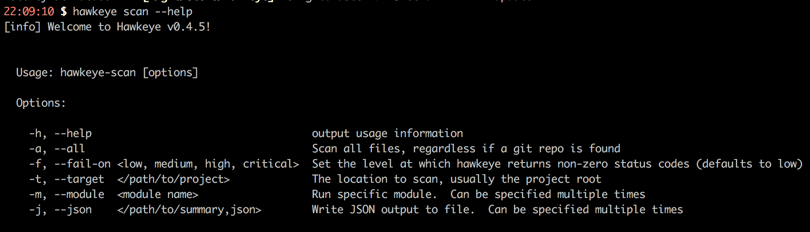
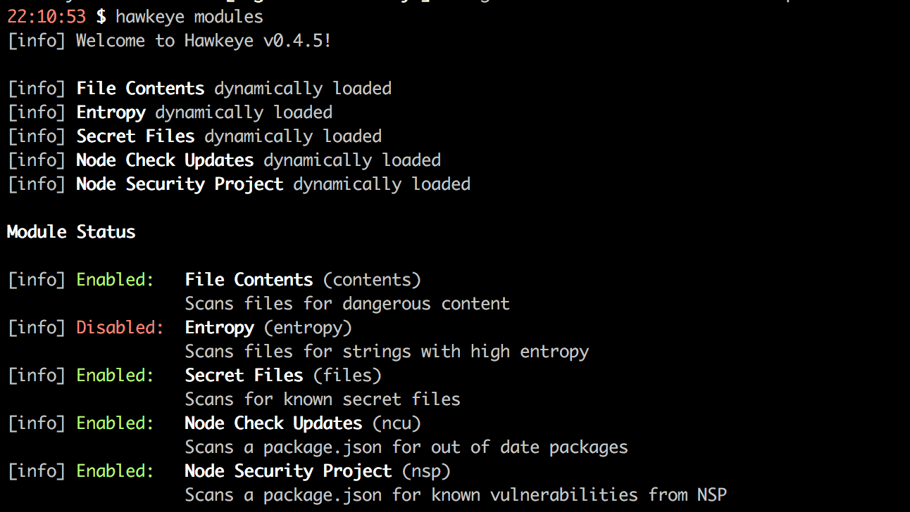
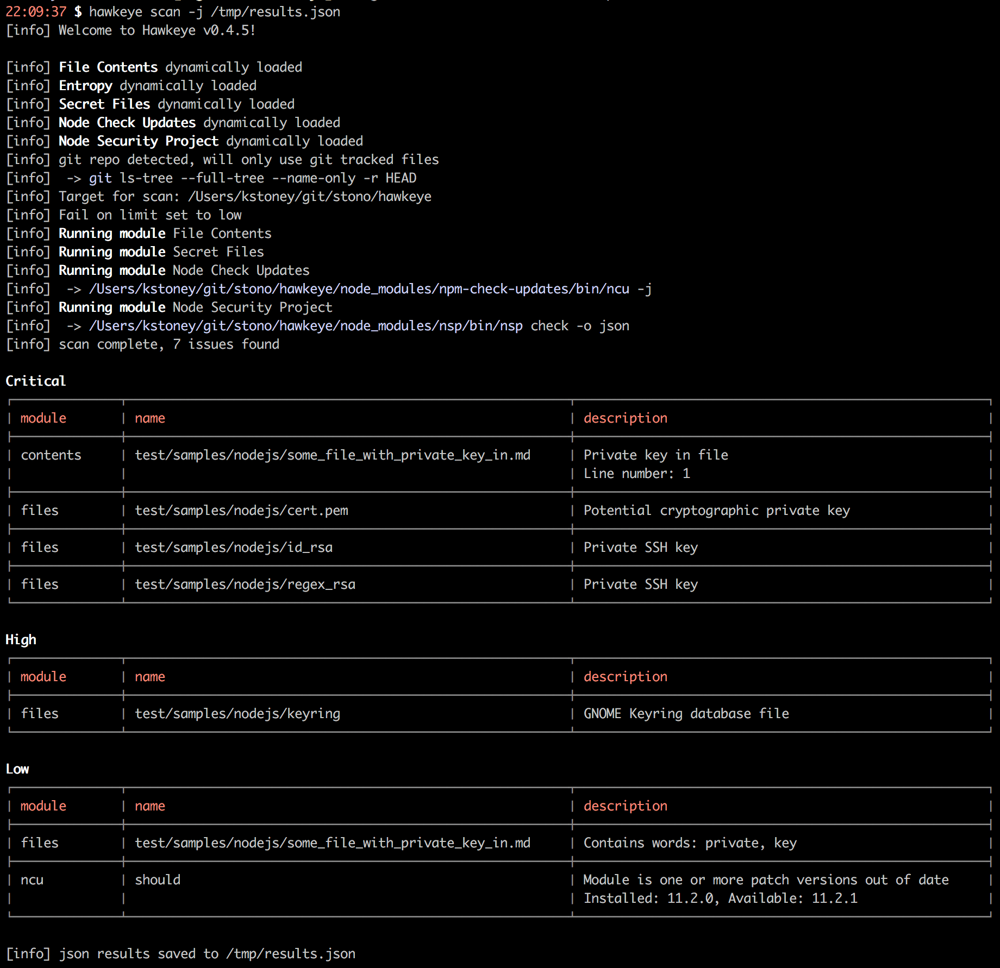

Hawkeye is a project security, vulnerability and general risk highlighting tool.  Designed to be entirely extensible by just adding new modules with the correct signature to `lib/modules`, the idea is to build up a suite of components which can be run stand alone, or as part of your continuous integration pipeline.

Modules implement a handler pattern so they will only run if their given criteria are met, for example the Node Security Project will only run if there is a `package.json` in the target directory.  This enables hawkeye to be language agnostic, and only run the modules relevant to the given scenario.

The added bonus is, it runs from docker; so doesn't require anything on your host machine.

## Modules
The following modules are currently implemented:

 - __File Names (files)__: Scan the file list recursively, looking for patterns as defined in [data.js](lib/modules/files/data.js).  We're looking for things like `id_rsa`, things that end in `pem`, etc.
 - __File Content Patterns (contents)__: Looks for patterns as defined in [data.js](lib/modules/content/data.js) within the contents of files, things like 'password: ', and 'BEGIN RSA PRIVATE KEY' will pop up here.
 - __File Content Entropy (entropy)__:  Scan files for strings with high (Shannon) entropy, which could indicate passwords or secrets stored in the files, for example: 'kwaKM@£rFKAM3(a2klma2d'
 - __Node Security Project (nsp)__: Scan the package.json (if present) and check for vulnerabilities on [Node Security Project](https://github.com/nodesecurity/nsp)
 - __NPM Check Updates (ncu)__: Wraps the [NPM Check Updates](https://github.com/tjunnone/npm-check-updates) module, to highlight outdated dependencies with increasing severity.

__Note:__ Entropy is disabled by default because it can return a lot of results, which are mostly misses, to run it please use the `-m entropy` switch.

__Note:__ We only look inside the contents of files up to 20kb, I plan to add configuration options in the future to allow you to change this.

## Running Hawkeye
I wanted Hawkeye to be as flexible as possible, as a result it supports numerous methods of execution.

### Standalone (command line)
There are two ways to run Hawkeye from the command line, the first is the easiest if you have nodejs on your host, simply type `npm install -g hawkeye-scanner` which will add the `hawkeye` binary to your path.

If you don't have, or want anything on your host, you can use docker with `docker run --rm -v $PWD:/target stono/hawkeye`.

__Note__: If you opt for docker and you are on macosx, please be aware that the `osxfs` is approx 20x slower than native filesystem access, so if you're scanning a particularly large project you may experience some slow down and the `npm` choice would be a better option.

### As part of your docker-compose file
This is where Hawkeye is lovely, lets say you have project which has a `Dockerfile`, with lines like this in:
```
COPY . /app
VOLUME /app
```

You could add hawkeye to your compose file like this:
```
services:
  app:
    build: .

  hawkeye:
    image: stono/hawkeye
    command: scan -t /app
    volumes_from:
      - app
```

You can simply do `docker-compose run --rm --no-deps hawkeye`.  Woo hoo.

### As part of your GoCD pipeline
If you're using [ci-in-a-box](https://github.com/Stono/ci-in-a-box) or something similar, you can add a pipeline step to run these scans automatically.  This is an example of running against the latest built image.

```
<pipeline name="security-scan">
  <stage name="Hawkeye" cleanWorkingDir="true">
    <jobs>
      <job name="scan">
        <tasks>
          <exec command="docker">
            <arg>pull</arg>
            <arg>stono/hawkeye</arg>
            <runif status="passed" />
          </exec>
          <exec command="bash">
            <arg>-c</arg>
            <arg>docker pull eu.gcr.io/your-project-name/your-image-name:latest</arg>
            <runif status="passed" />
          </exec>
          <exec command="bash">
            <arg>-c</arg>
            <arg>docker run --entrypoint=/bin/true --name=your-image-name_latest eu.gcr.io/your-project-name/your-image-name:latest</arg>
            <runif status="passed" />
          </exec>
          <exec command="bash">
            <arg>-c</arg>
            <arg>docker run --rm --volumes-from your-image-name_latest stono/hawkeye scan --target /app</arg>
            <runif status="passed" />
          </exec>
          <exec command="bash">
            <arg>-c</arg>
            <arg>docker rm -f your-image-name_latest</arg>
            <runif status="any" />
          </exec>
        </tasks>
      </job>
    </jobs>
  </stage>
</pipeline>
```

## The CLI
### `hawkeye scan`
There are a few options available:



#### --all: Running against all files rather than git tree
Hawkeye by default will attempt to detect a .git folder in your target, if it is there it will only scan git tracked files.  If there is no .git in the target directory, then all files will be scanned.

You can override this behaviour with the `--all` flag, which will scan all files regardless.

#### --fail-on: When to exit with a non-zero status code
From a pipeline perspective, the `--fail-on` command is useful, you might now wish for `low` items to break your build, so you could use `--fail-on medium`.

#### --target: Specfiy what to scan
By default Hawkeye will look in your current working directory.  You can override this behaviour though by specifying a `--target`

#### --module: Running only specific modules
If you want to run specific modules only, you can use the `--module` flag, which can be specified multiple times.  For example `hawkeye scan -m nsp -m ncu` would run just the nsp and ncu modules.

#### --json: Producing a JSON artefact 
You can specify the `json` and `module` parameters multiple times, for example `hawkeye scan -m files -m contents -j /tmp/file1.json -j /tmp/file2.json` would run the modules `files` and `contents` and write two output files

### `hawkeye modules`
You can view the module status with `hawkeye modules`.  As previously mentioned you can see that entropy is disabled by default.  If you want to run it, use the `-m entropy` flag.



## Outputs
At the moment, Hawkeye supports two output writers.

### Summary
The output is a summary view of what we found, and is always enabled.  Significantly more details can be obtained by using the `--json` flag to write a json artefact.



### Json
You can output much more information in the form of a JSON artefact that groups by executed module.  Check out a sample [here](test/samples/results.json)

```
  {
    "module": {
      "key": "nsp",
      "name": "Node Security Project",
      "description": "Scans a package.json for known vulnerabilities from NSP"
    },
    "results": {
      "high": [
        {
          "key": "nsp-cvss",
          "name": "negotiator",
          "description": "https://nodesecurity.io/advisories/106\nods-jl@0.0.0 > express@4.13.4 > accepts@1.2.13 > negotiator@0.5.3",
          "data": {
            "id": 106,
            "updated_at": "2016-06-16T20:37:24.000Z",
            "created_at": "2016-05-04T16:34:12.000Z",
            "publish_date": "2016-06-16T17:36:06.000Z",
            "overview": "negotiator is an HTTP content negotiator for Node.js and is used by many modules and frameworks including Express and Koa.\n\nThe header for \"Accept-Language\", when parsed by negotiator is vulnerable to Regular
Expression Denial of Service via a specially crafted string. \n\nTimeline\n\n- April 29th 2016 - Initial report to maintainers\n- April 29th 2016 - Confirm receipt from maintainers\n- May 1st 2016 - Fix confirmed\n- May 5th 2016 - 0.6.1 p
ublished with fix\n- June 16th 2016 - Advisory published (delay was to coordinate fixes in upstream frameworks, Koa and Express)",
            "recommendation": "Upgrade to at least version 0.6.1\n\nExpress users should update to Express 4.14.0 or greater. If you want to see if you are using a vulnerable call,  a quick grep for the `acceptsLanguages` function call in
 your application will tell you if you are using this functionality.",
            "cvss_vector": "CVSS:3.0/AV:N/AC:L/PR:N/UI:N/S:U/C:N/I:N/A:H",
            "cvss_score": 7.5,
            "module": "negotiator",
            "version": "0.5.3",
            "vulnerable_versions": "<= 0.6.0",
            "patched_versions": ">= 0.6.1",
            "title": "Regular Expression Denial of Service",
            "path": [
              "ods-jl@0.0.0",
              "express@4.13.4",
              "accepts@1.2.13",
              "negotiator@0.5.3"
            ],
            "advisory": "https://nodesecurity.io/advisories/106"
          }
        }
    ]
....

```

## Development

### Adding a new handler
The idea is that this project should be super extensible, I want people to write new handlers with ease.  Simply create a handler in `lib/modules` which exposes the following signature:

  - key: A short alphanumeric key for your module
  - name: The name of your module
  - description: The description of your module
  - enabled: True or Fale as to if this module should run by default, or if it needs to be specified with `--module`
  - function handles(path): A function to decide if this handler should run against the target path
  - function run(results, done): The function which is called if handles returns true

### The run function
The first argument passed is `results`, this is where the module should send its results to, it exposes four methods for each 'level' of issue found, `critical`, `high`, `medium` and `low`.  Those methods expect you to pass something like this:

```
results.critial('title', 'description', { additional: 'data' });
```

### Example
Because I'm kind, and I __REALLY__ want people to contribute, check out [lib/modules/example-shell/index.js](lib/modules/example-shell/index.js).
